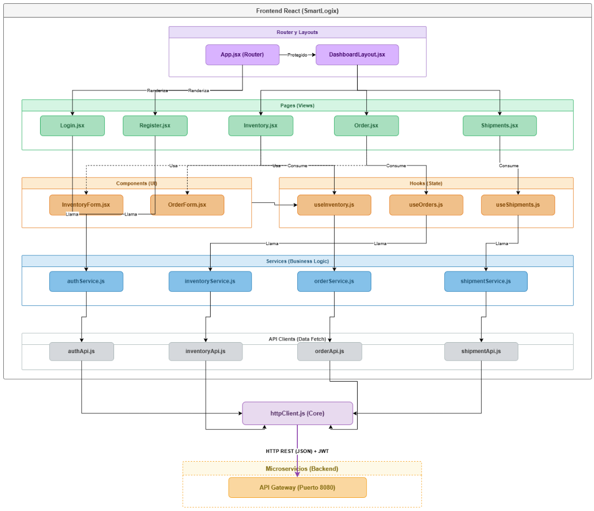

# INFORME DE FULLSTACK III

**Caso:** SmartLogix
**Integrantes:** Mirko Lucic / Ashley Vargas

> **DUOC UC**
> Asignatura: Desarrollo Fullstack III - Semestre 01 2026
> Profesor: Anyelo Castellon Rios

---

## 1. Introducción

Este documento detalla la arquitectura, funcionalidades implementadas y la metodología de control de versiones utilizada para el desarrollo de la interfaz de usuario (Frontend) de la plataforma logística SmartLogix.

---

## 2. Arquitectura - Diagrama por capas

El frontend fue diseñado utilizando un patrón de Arquitectura por Capas altamente modularizado en React. Esto garantiza la separación de responsabilidades: las Vistas (Pages) se apoyan en Componentes y Hooks, delegando la lógica de negocio a los Servicios, los cuales utilizan la capa de API para comunicarse centralizadamente con el Gateway del Backend.

El diagrama muestra cómo está organizado el frontend de SmartLogix en capas, donde cada capa tiene una responsabilidad específica y se comunica solo con la capa inmediatamente inferior.

### Capa 1 - Router y Layouts

App.jsx es el punto de entrada de toda la app. Decide qué renderizar según la URL. Tiene dos caminos: si el usuario no está autenticado, renderiza Login.jsx o Register.jsx directamente. Si está autenticado, renderiza DashboardLayout.jsx, que actúa como el "marco" visual (menú lateral, header, etc.) dentro del cual viven todas las páginas protegidas.

### Capa 2 - Pages (Views)

Son las 5 pantallas de la aplicación. Login.jsx y Register.jsx vienen directo del router. Inventory.jsx, Order.jsx y Shipments.jsx viven dentro del layout del dashboard. Cada página es responsable de lo que el usuario ve y de coordinar los datos que necesita mostrar.

### Capa 3 - Components (UI) + Hooks (State)

Aquí hay dos sublayers paralelas:

#### Components

InventoryForm.jsx y OrderForm.jsx son componentes reutilizables de formulario. La línea punteada desde las páginas indica una dependencia opcional - la página los usa pero no siempre los necesita activos.

#### Hooks

useInventory.js, useOrders.js y useShipments.js encapsulan el estado y la lógica de cada dominio. Cuando una página necesita datos o quiere ejecutar una acción, llama al hook correspondiente en lugar de manejar todo eso internamente.

### Capa 4 - Services (Business Logic)

Los servicios son el "cerebro" de cada dominio. Reciben instrucciones desde los hooks (o directamente desde las páginas de auth) y deciden cómo procesarlas: validaciones, transformaciones de datos, manejo de errores de negocio. authService.js lo usan tanto Login como Register. Los otros tres servicios los usan sus hooks respectivos.

### Capa 5 - API Clients (Data Fetch)

Son los traductores entre la lógica del frontend y el protocolo HTTP. Cada servicio tiene su propio cliente de API: authApi.js, inventoryApi.js, orderApi.js y shipmentApi.js. Saben exactamente qué endpoints llamar, con qué parámetros, y cómo formatear el request.

### httpClient.js (Core)

Es el único punto que realmente hace las llamadas HTTP. Todos los API clients lo usan. Aquí es donde vive la configuración global: la URL base del backend, los headers de autenticación (el token JWT), el manejo de errores HTTP (401, 500, etc.), y los interceptores. Si mañana cambia el servidor o el esquema de autenticación, solo se modifica este archivo.

### API Gateway (Puerto 8080)

Es el primer punto de entrada al backend. Recibe todos los requests del frontend vía HTTP REST con JSON, autenticados con JWT. Desde ahí distribuye a los microservicios correspondientes (inventario, órdenes, envíos, auth), aunque eso ya es arquitectura de backend y no se muestra en este diagrama.

El flujo completo de una acción típica - por ejemplo, el usuario carga la página de inventario:

`Inventory.jsx` llama a → `useInventory.js` que llama a → `inventoryService.js` que llama a → `inventoryApi.js` que usa → `httpClient.js` que hace GET al API Gateway que responde → → con JSON y los datos suben de vuelta por la misma cadena hasta pintarse en → pantalla.

---

## 3. Funcionalidades del Frontend

El sistema implementa de forma robusta la orquestación de los microservicios del backend mediante una interfaz interactiva:

### Módulo de Autenticación y Seguridad

* **Registro de Usuarios:** Permite la creación de nuevas cuentas enviando credenciales validadas.
* **Inicio de Sesión (Login):** Autentica al usuario, obtiene el token JWT y lo almacena de forma segura en localStorage.
* **Control de Acceso (RBAC):** La interfaz y las rutas privadas se adaptan según el rol del usuario logueado (`ROLE_ADMIN`, `ROLE_USER`, `ROLE_WAREHOUSE_MANAGER`).

### Módulo de Inventario

* **Patrón Maestro-Detalle:** Presenta un catálogo interactivo y un panel de inspección detallado.
* **Operaciones de Stock:** Incluye flujos completos para Reservar, Liberar y Despachar unidades, actualizando en tiempo real la disponibilidad.

### Módulo de Pedidos (Orquestación)

* **Creación Dinámica de Órdenes:** Formulario avanzado que permite agregar múltiples líneas de productos, verificando el catálogo y sincronizando precios.
* **Manejo de Excepciones Logísticas:** Si el microservicio de envíos falla durante la creación del pedido (estado FAILED), el frontend atrapa este comportamiento e informa al usuario mediante una alerta amigable sobre la necesidad de asignación manual.

### Módulo de Envíos y Logística

* **Hoja de Ruta y Tracking:** Despliega la asignación de transportistas, fechas estimadas y códigos de seguimiento.
* **Asignación Manual y Estados:** Permite inyectar manualmente órdenes huérfanas y simular el ciclo logístico completo (`PLANNED`, `PICKED_UP`, `IN_TRANSIT`, `DELIVERED`).

---

## 4. Estrategia por ramas (Branch - Merge)

Para mantener la integridad del código fuente, asegurar la calidad del proyecto y evitar colisiones (conflictos), se implementó una estrategia de tres ramas principales, inspirada en GitFlow:

### 1. main (o master): Producción

* Es la rama principal e intocable. Solo contiene código que ha sido 100% probado, validado y que está listo para ser entregado o desplegado a los usuarios finales.
* No se programa directamente en esta rama.

### 2. develop: Integración Continua

* Es la rama base de desarrollo. Aquí se consolida todo el trabajo.
* Cuando una nueva característica o módulo está listo, se fusiona (merge) hacia develop para comprobar que interactúa correctamente con el resto del sistema antes de pasar a main.

### 3. testing / feature/* (Ej. feature/crud-inventario): Desarrollo Aislado

* Son ramas efímeras (temporales) creadas a partir de develop.
* En ellas se desarrolló código nuevo (como el patrón Maestro-Detalle o el manejo de advertencias del linter de React).
* **Ventaja:** Permitió realizar pruebas, romper el código y arreglarlo sin afectar a los demás desarrolladores ni desestabilizar el proyecto.
* **Flujo de vida:** Una vez que la pantalla estaba funcional y sin errores, se hizo un Merge hacia develop y la rama temporal fue eliminada para mantener el repositorio limpio.

---

## 4. Conclusiones

✔ El desarrollo del frontend de SmartLogix ha dado como resultado una aplicación web robusta, escalable y altamente modular.

✔ La implementación de una arquitectura estricta por capas ha demostrado ser fundamental para separar las responsabilidades, facilitando tanto el mantenimiento del código como la comunicación eficiente y centralizada con el ecosistema de microservicios a través del API Gateway.

✔ Adicionalmente, la adopción de una metodología de control de versiones estructurada en tres niveles (main, develop y ramas efímeras) garantizó un ciclo de vida del software seguro y organizado, permitiendo el desarrollo de nuevas características sin poner en riesgo la estabilidad del sistema.

✔ La plataforma cumple con éxito todos los requerimientos de orquestación, gestión de inventario y logística, entregando una interfaz funcional, segura y preparada para el crecimiento futuro de la PYME.
